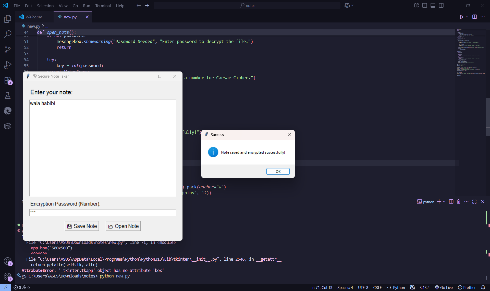
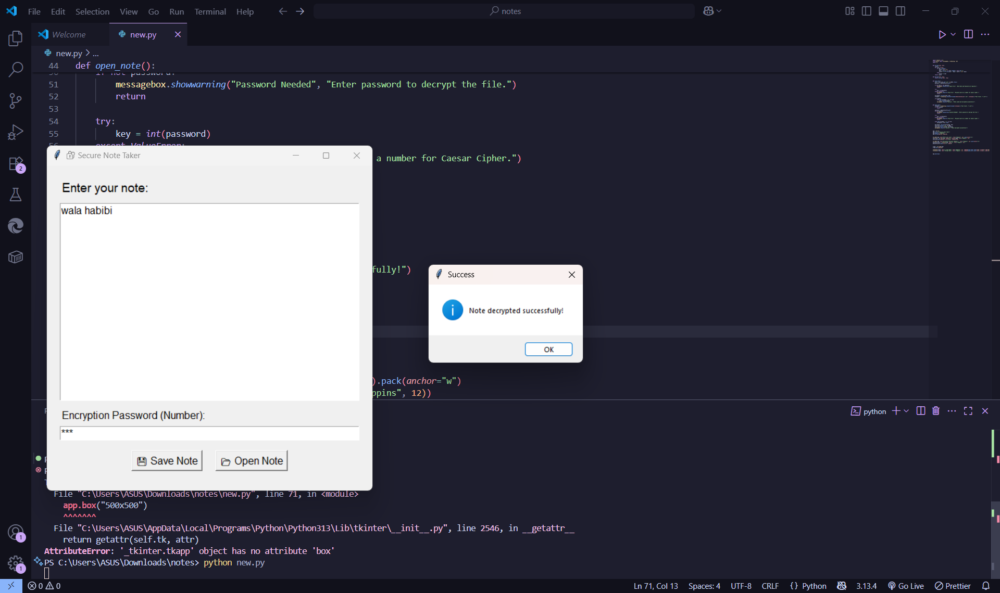

# 🛡️ Secure Note  - Caesar Cipher GUI App

A simple Python-based desktop app that allows users to **create, encrypt, decrypt, and save secure notes** using the classic Caesar Cipher encryption technique.

## 🔐 Features

- 📝 Write and save text notes
- 🔒 Encrypt notes using Caesar Cipher
- 🔓 Decrypt notes with the correct numeric key
- 💻 User-friendly GUI made with **Tkinter**
- 📁 Save/load notes from `.txt` files

---

## 📸 Screenshot


<!-- Replace with actual screenshot if available -->

---

## ⚙️ How It Works

This app uses the **Caesar Cipher**, a simple substitution encryption technique where:
- Each letter is **shifted** by a number of positions (the "key")
- For example:  
  - Key = 3  
  - `A` → `D`, `B` → `E`, …, `Z` → `C`

Decryption reverses this by shifting in the opposite direction.

---

## 🧠 What You’ll Learn

- Python basics (functions, conditionals, loops)
- Working with strings and ASCII values (`ord()` & `chr()`)
- GUI development with **Tkinter**
- File handling in Python
- Basics of classical encryption

---

## 🛠️ Installation & Usage

### 📦 Requirements

- Python 3.x

### ▶️ Run the App

1. Clone the repository
```bash
git clone https://github.com/your-username/Secure-Notes
cd Secure-Notes
python secure_notes.py
